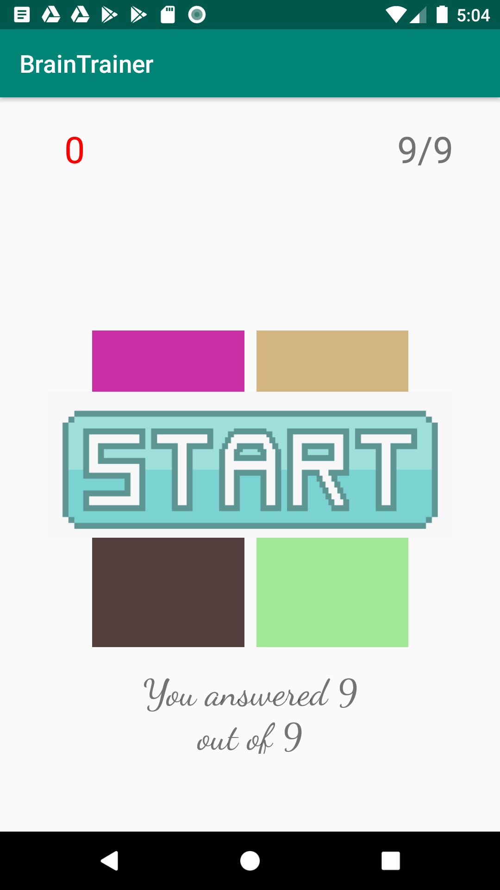

# android_brain_trainer_starter_code
Hello guys this is a simple brain trainer app. You can use this to learn about
 - Radomely change colors
 - How button click works
 - How simple animations work
 
This app is not available in AppStore. So feel free to change this code and use in your application. 

Note: remove the screenshot of the app inside the drawable before using :) .

Thank you.

[Oreo Development Course](https://www.udemy.com/share/101Y5MAkMcdl5bRXo=/)
